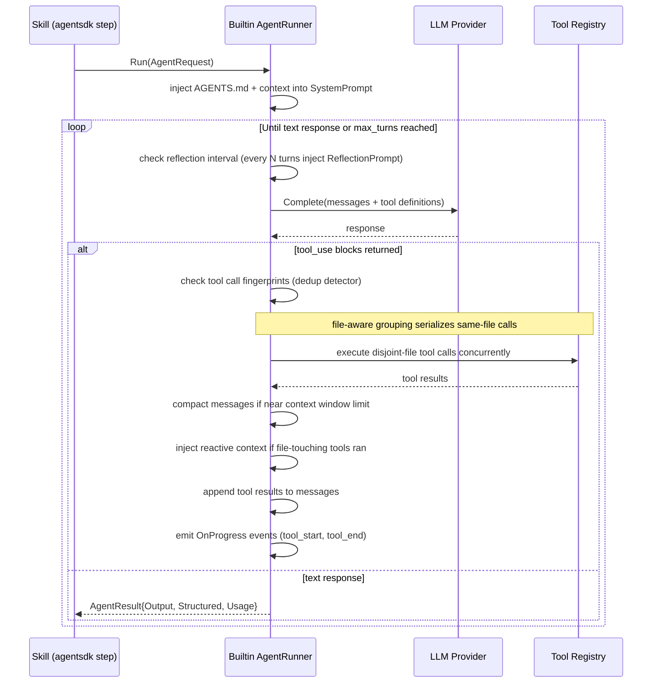
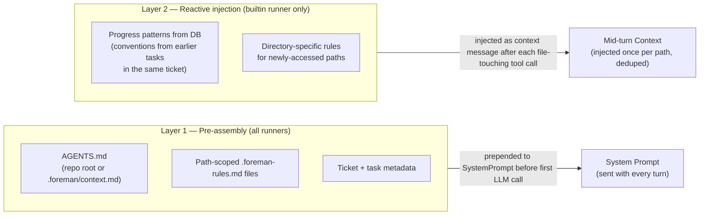

# Agent Runner

The `AgentRunner` interface allows skills to delegate open-ended, multi-turn tasks to an AI coding agent. Three implementations are provided: a built-in runner that uses Foreman's own LLM provider, and two delegating runners for Claude Code and GitHub Copilot.

The agent runner is used exclusively by `agentsdk` skill steps — it is not used inside the core pipeline (which uses direct `LlmProvider.Complete` calls for cost and determinism reasons).

---

## Interface

```go
type AgentRunner interface {
    Run(ctx context.Context, req AgentRequest) (AgentResult, error)
    HealthCheck(ctx context.Context) error
    RunnerName() string
    Close() error
}

type AgentRequest struct {
    Prompt          string           // Task description
    SystemPrompt    string           // Prepended to the agent's system prompt
    WorkDir         string           // Working directory for file operations
    FallbackModel   string           // Override model for this agent task (per-model router)
    AllowedTools    []string         // Restrict tools (empty = runner default)
    MCPServers      []MCPServerConfig // MCP servers to attach for this session
    OutputSchema    json.RawMessage  // JSON Schema for structured output (optional)
    OnProgress      func(AgentEvent) // Optional real-time progress callback
    MaxTurns        int              // 0 = runner default
    TimeoutSecs     int              // 0 = runner default
    RemainingBudget int              // Remaining turn budget from parent (0 = unlimited)
    AgentDepth      int              // Current nesting depth; enforced against MaxAgentDepth
}

// AgentEvent is emitted by the builtin runner for real-time progress visibility.
type AgentEvent struct {
    Type      AgentEventType // turn_start | tool_start | tool_end | turn_end
    ToolName  string
    Turn      int
    TokensIn  int
    TokensOut int
    CostUSD   float64
}

type AgentResult struct {
    Output     string      // Final text or JSON string output
    Structured interface{} // Populated if OutputSchema was provided
    Usage      AgentUsage
}

type AgentUsage struct {
    InputTokens  int
    OutputTokens int
    CostUSD      float64
    NumTurns     int
    DurationMs   int
}
```

---

## Configuration

```toml
[agent_runner]
type = "builtin"   # builtin | claudecode | copilot

[agent_runner.builtin]
max_turns          = 20
timeout_secs       = 300
reflection_interval = 5    # Self-reflection every N turns (0 = disabled)
model              = ""    # Override model for agent tasks (empty = use implementer model)
```

---

## Builtin Runner

The builtin runner implements a multi-turn tool-use loop on top of Foreman's own `LlmProvider`. It is the default runner and requires no external tools.

### How It Works

1. The runner sends the initial prompt to the configured LLM provider with a set of tool definitions.
2. When the model returns a `tool_use` response, the runner executes all tool calls in parallel.
3. Tool results are fed back to the model in the next turn.
4. The loop continues until the model stops requesting tool calls or `max_turns` is reached.



### File-Aware Parallel Tool Execution

Before executing a batch of tool calls, the runner groups them by the file paths in their arguments. Tool calls operating on disjoint file sets run in parallel via `errgroup`. Tool calls sharing any file path execute sequentially in LLM-return order. Non-filesystem tools always run in parallel. This prevents edit-edit conflicts without sacrificing parallel speed for independent operations.

### Two-Layer Context Injection

The builtin runner injects project context through two mechanisms:



**Layer 1 — Pre-assembly (all runners):** Before any runner is called, the skills engine pre-assembles:
- `AGENTS.md` from the repo root (or `.foreman/context.md` as fallback)
- Path-scoped rules from `.foreman-rules.md` files
- Ticket and task metadata

This is prepended to `AgentRequest.SystemPrompt` for all three runner implementations.

**Layer 2 — Reactive injection (builtin only):** After each file-touching tool call (Read, ReadRange, Edit, Write, ApplyPatch, GetDiff), the builtin runner queries the database for:
- Progress patterns relevant to the accessed directories (coding conventions discovered during earlier tasks)
- Directory-specific rules for the newly accessed paths

These are injected as a context message before the next LLM turn. The runner tracks what has already been injected to avoid duplication.

### Configuration

```toml
[agent_runner.builtin]
max_turns           = 20
timeout_secs        = 300
reflection_interval = 5     # 0 = disable self-reflection turns
model               = ""     # Override model (empty = implementer model)
```

Set `model` to use a cheaper model for agent (skill) tasks without changing the core pipeline model routing.

### Context Window Management

After each turn the runner measures the total message history in tokens (via tiktoken-go). Actions taken by threshold:

| Threshold | Action |
|---|---|
| 70% of context window | Old tool outputs truncated to 200-char summaries |
| 85% of context window | Structured summary (Goal → Accomplished → Remaining → Files) replaces all messages older than the last 3 turns |

### Self-Reflection Turns

Every `reflection_interval` turns (default: 5) the runner injects a structured message before the next LLM call:

> *"Before continuing, briefly summarise: (1) what you have accomplished, (2) which files you have changed, and (3) what remains. If the task is already complete, reply with exactly: TASK_COMPLETE"*

If the reply contains `TASK_COMPLETE`, the loop exits early. Reflection turns are logged as a distinct `reflection` turn type in `llm_calls`.

### Tool Call Deduplication

The runner maintains an in-memory fingerprint map keyed by `(tool_name, canonical_args_hash)`. When the same fingerprint appears ≥ 2 times in a session, the following warning is injected before the next LLM turn:

> *"You have already called [tool] with these arguments. Either the previous result was insufficient — explain why and what is different this time — or proceed using the information you already have."*

This does not hard-block execution; it is a guidance injection only.

### Agent Progress Events

When `AgentRequest.OnProgress` is set, the builtin runner emits events at these checkpoints:

| Event | When |
|---|---|
| `turn_start` | Before each LLM call |
| `tool_start` | Before each individual tool execution |
| `tool_end` | After each tool execution |
| `turn_end` | After tool results are appended (includes token counts and cost) |

The orchestrator wires `OnProgress` to the `EventEmitter` for real-time dashboard updates and to the cost controller for mid-execution budget enforcement.

### Subagent Budget Inheritance

When the `Subagent` tool is called, the subagent's `MaxTurns` is set to:
```
min(subagent_max_turns_default, parent.RemainingBudget - currentTurn)
```
If the result is ≤ 0, the call fails immediately with `"parent budget exhausted"`. A global `MaxAgentDepth` constant (default: 3) prevents infinite recursion — the `Subagent` call fails with `"max agent depth exceeded"` at the limit.

---

## Built-in Tools

The builtin runner provides typed tools via a `tools.Registry`. All tool schemas are hand-written JSON Schema — no reflection dependency.

### Filesystem

| Tool | Description |
|---|---|
| `Read` | Read a file's full contents. Enforces path guard (no traversal, no absolute paths). |
| `ReadRange` | Read a line range from a file (`start_line`, `end_line`; 1-based). Avoids consuming the full token budget for large files. |
| `Write` | Write a file. Checks secrets patterns on both the path and content before writing. |
| `Edit` | Apply a SEARCH/REPLACE block to a file. Fuzzy matching at the configured threshold. |
| `MultiEdit` | Apply multiple SEARCH/REPLACE blocks to a file in a single call. |
| `ApplyPatch` | Apply a unified diff format patch to a file. Fails with the specific rejection reason on a bad hunk rather than leaving partial state. |
| `ListDir` | List directory contents with file sizes. |
| `Glob` | Find files matching a glob pattern relative to the working directory. |

### Code Intelligence

| Tool | Description |
|---|---|
| `Grep` | Search for a regex pattern across files (with optional file glob filter). |
| `GetSymbol` | Extract a named symbol (function, type, variable) from a file. |
| `GetErrors` | Run the project's type checker or compiler and return structured errors. |
| `TreeSummary` | Return a compact directory tree summary (depth-limited). |

### Git

| Tool | Description |
|---|---|
| `GetDiff` | Get the current working diff or diff between two refs. |
| `GetCommitLog` | Get recent commit messages and metadata. |

### Execution

| Tool | Description |
|---|---|
| `Bash` | Run an arbitrary shell command. Subject to the runner's allowed commands list. |
| `RunTest` | Run the project's test suite and return structured pass/fail output. |

### Agent Composition

| Tool | Description |
|---|---|
| `Subagent` | Spawn a sub-agent with a fresh prompt. Budget is capped to parent's remaining turns. |
| `ListMCPTools` | Return all registered MCP tools from the in-memory registry (read-only). |
| `ReadMCPResource` | Read a resource from a named MCP server (`server`, `uri`). Subject to secrets scanning. |

### Path Guards

All filesystem tools enforce:
- **No path traversal**: paths like `../../etc/passwd` are rejected
- **Relative paths only**: absolute paths are rejected  
- **Secrets blocking**: writes to `.env`, `*.key`, `*.pem`, and files containing private key content patterns are rejected

---

## Claude Code Runner

The Claude Code runner delegates tasks to the `claude` CLI binary. It requires the Claude Code CLI to be installed.

```toml
[agent_runner]
type = "claudecode"

[agent_runner.claudecode]
binary_path  = "claude"   # Path to the claude binary (must be on $PATH or absolute)
max_turns    = 20
timeout_secs = 300
```

### How It Works

The runner invokes:

```bash
claude -p --output-format json "<prompt>"
```

The `--output-format json` flag produces a structured `SDKResultMessage` containing the final output, total cost, number of turns, and token usage. Foreman parses this and maps it to `AgentResult`.

### System Prompt Injection

Before invoking the CLI, Foreman prepends the pre-assembled `SystemPrompt` from `AgentRequest` to the prompt. This includes `AGENTS.md` content and ticket metadata assembled by the skills engine.

### Requirements

- `claude` CLI must be installed (see the Claude Code documentation).
- A valid Anthropic API key must be available to the `claude` binary (typically via `ANTHROPIC_API_KEY`).

---

## Copilot Runner

The Copilot runner delegates tasks to the GitHub Copilot CLI via session-based JSON-RPC.

```toml
[agent_runner]
type = "copilot"

[agent_runner.copilot]
timeout_secs = 300
```

### How It Works

The runner uses the Copilot SDK Go client:

1. `NewClient()` — establish a connection to the Copilot CLI subprocess
2. `CreateSession()` — start a new agent session
3. `SendAndWait()` — send the prompt and wait for a complete response
4. `Destroy()` — tear down the session

### System Prompt Injection

The pre-assembled `SystemPrompt` from `AgentRequest` is passed to `SendAndWait` as a system message prefix, consistent with the other runner implementations.

### Requirements

- GitHub Copilot CLI must be installed and authenticated.
- A GitHub account with a Copilot subscription.

---

## Structured Output

When an `agentsdk` skill step specifies `output_schema`, the runner attempts to return structured JSON matching the schema.

**Builtin runner:** Passes the schema as `OutputSchema` in `LlmRequest`. Anthropic enforces the schema via forced tool use; OpenAI uses `response_format.json_schema`. The final output is validated against the schema and returned as `AgentResult.Structured`.

**Claude Code runner:** Passes the schema via the `--json-schema` CLI flag (if available) or injects a schema description into the prompt. Output is parsed and validated.

**Copilot runner:** Schema is injected as a prompt instruction. Output validation is best-effort.

---

## Health Checks

```bash
./foreman doctor
```

The `doctor` command runs `AgentRunner.HealthCheck()` for the configured runner:

- **Builtin**: verifies the LLM provider is reachable.
- **Claude Code**: checks that the `claude` binary is on `$PATH` and can execute.
- **Copilot**: checks that the Copilot CLI is installed and authenticated.

---

## Choosing a Runner

| Consideration | Builtin | Claude Code | Copilot |
|---|---|---|---|
| External binary required | No | Yes (`claude`) | Yes (Copilot CLI) |
| Works with any LLM provider | Yes | No (Anthropic only) | No (GitHub Copilot) |
| File-aware parallel tool execution | Yes | Handled by claude | Handled by Copilot |
| Context window management | Yes (auto-compaction) | Handled by claude | Handled by Copilot |
| Self-reflection turns | Yes (configurable) | No | No |
| Tool call deduplication | Yes | No | No |
| Agent progress events (`OnProgress`) | Yes | No | No |
| Subagent budget inheritance | Yes | No | No |
| Reactive context injection | Yes | No | No |
| MCP tools + resources | Yes | No | No |
| Per-task model override | Yes (`model` config) | Fixed to claude | Fixed to Copilot |
| Structured output (schema) | Full support | Partial (flag) | Prompt-based |
| Extended thinking | Via `LlmRequest` | Via `claude` flags | No |
| Custom tool restrictions | Yes (per step) | Limited | Limited |
| Cost attribution | Full (tracked in DB) | Approximate (from JSON) | Not exposed |

**Recommendation:** Use `builtin` for most cases. Use `claudecode` if you specifically need Claude Code's native file editing capabilities. Use `copilot` in environments where GitHub Copilot is already the standard AI tool.

---

## Adding a Custom Runner

Implement the `AgentRunner` interface:

```go
// internal/agent/runner.go
type AgentRunner interface {
    Run(ctx context.Context, req AgentRequest) (AgentResult, error)
    HealthCheck(ctx context.Context) error
    RunnerName() string
    Close() error
}
```

Register it in the factory:

```go
// internal/agent/factory.go
func New(cfg config.AgentRunnerConfig, ...) (AgentRunner, error) {
    switch cfg.Type {
    case "builtin":
        return newBuiltin(cfg, ...)
    case "claudecode":
        return newClaudeCode(cfg)
    case "copilot":
        return newCopilot(cfg)
    case "myrunner":
        return newMyRunner(cfg)  // Add your case here
    }
}
```

The runner name from `RunnerName()` appears in logs and the dashboard.

---

## MCP Support

Foreman supports MCP servers via two mechanisms:

### Anthropic API-Side MCP

Set `URL` and `AuthToken` in `MCPServerConfig` and pass it in the Anthropic API request. Anthropic's infrastructure connects to the server server-side — no local subprocess is needed.

### stdio Transport (Client-Side)

The builtin runner can connect to MCP servers as local subprocesses over stdin/stdout using JSON-RPC 2.0. The `StdioClient` (`internal/agent/mcp/stdio_client.go`) handles:

- Subprocess lifecycle management (spawn, restart on failure, shutdown)
- `initialize` handshake and `tools/list` discovery
- Concurrent `tools/call` multiplexing via an atomic request ID and per-request response channels

The `Manager` (`internal/agent/mcp/manager.go`) aggregates tools from all registered servers and routes `tools/call` requests by matching the `mcp_{server}_` name prefix.

Tool names are normalized by `MCPToolName(server, tool string) string` (`internal/agent/mcp/naming.go`): special characters (`-`, `.`, spaces) are replaced with `_`, the result is prefixed with `mcp_`, and names longer than 64 characters (OpenAI limit) are truncated with a 6-character hash suffix.

Configure stdio MCP servers in `foreman.toml`:

```toml
[[mcp.servers]]
name    = "my-server"
command = "npx"
args    = ["-y", "@company/my-mcp-server"]
allowed_tools               = ["query", "schema"]  # optional whitelist
restart_policy              = "on-failure"         # always | never | on-failure
max_restarts                = 3
restart_delay_secs          = 2
health_check_interval_secs  = 30                   # ping interval (0 = disable)
[mcp.servers.env]
DB_URL = "${DATABASE_URL}"
```

### MCP Resources

The `StdioClient` supports `resources/list` and `resources/read` in addition to `tools`. The `Manager` exposes `ReadResource(ctx, serverName, uri string) (string, error)`. The `ReadMCPResource` agent tool surfaces this to the LLM. Resource content is subject to secrets scanning. Maximum response size is controlled by `mcp_resource_max_bytes` (default: 512 KB).

### MCP Health Monitoring

Each `StdioClient` sends periodic `ping` requests at the configured interval. If a ping does not respond within 5 s, the server is marked `unhealthy`. After 3 consecutive failures, the configured `restart_policy` is applied. Server health is exposed on the dashboard REST API (`GET /api/mcp/servers`) and WebSocket feed.

**Scope boundaries:** HTTP/SSE transport is not implemented (Wave 4). `prompts` endpoint is not supported.

---

## See Also

- [Skills](skills.md) — `agentsdk` step type that invokes the agent runner
- [Architecture](architecture.md) — where the agent runner fits in the overall system
- [Configuration](configuration.md#agent-runner) — `[agent_runner]` config reference
- [Development](development.md) — how to add a new agent runner implementation
