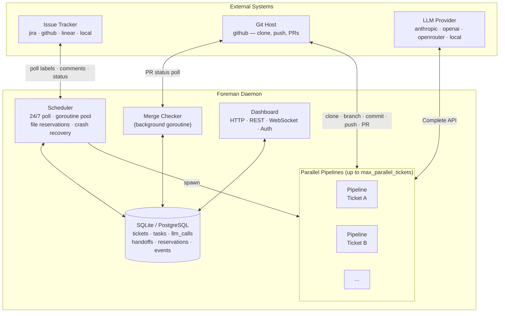
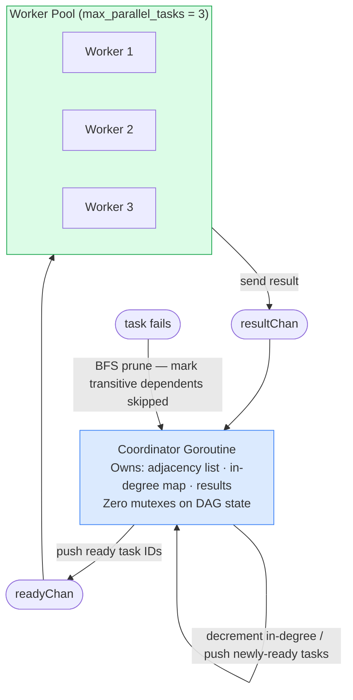

# Architecture

## Overview

Foreman is a single Go binary structured as a daemon with a pluggable, interface-first core. Every external dependency — LLM provider, issue tracker, git host, command runner, database — is hidden behind a Go interface. Implementations are swappable without touching the pipeline.



## Design Principles

### 1. Stateless LLM Calls
Every LLM call receives fully assembled context reconstructed from the database and repository. There is no accumulated conversation memory between calls. State lives in git history and the database. Retries are explicitly managed by deterministic code, not by LLM memory.

### 2. Deterministic Scaffolding
Git operations, linting, test execution, PR creation, and issue tracker updates are deterministic Go code. The LLM is used only for tasks that require judgment — planning, coding, reviewing. This keeps costs predictable and makes failures debuggable.

### 3. Fresh Context Per Call
Every LLM call starts with zero memory. Context is reconstructed from structured handoffs stored in the database, git history, and the current repository state. This avoids hallucinated state from previous calls.

### 4. Pluggable Everything
All external dependencies are behind Go interfaces. You can swap the LLM provider, issue tracker, git backend, and command runner without modifying the pipeline.

### 5. Graceful Degradation
Partial success is better than total failure. If 4 of 5 tasks succeed, Foreman creates a partial PR with the completed work. If a provider is down, the pipeline pauses and retries on the next poll cycle instead of failing the ticket.

### 6. Request-Level Tracing
Every ticket and LLM call receives a `trace_id` at pickup time, propagated through all goroutines via `context.Context`. Trace IDs appear in structured log fields and are stored in `tickets.trace_id` and `llm_calls.trace_id` for cross-service correlation.

---

## Package Structure

```
internal/
├── channel/        Messaging channel abstraction (Channel, Router, Classifier, Pairing)
│   └── whatsapp/   WhatsApp implementation via whatsmeow (Web multi-device protocol)
├── config/         TOML config loading, validation, env-var substitution, round-trip TOML editing
├── daemon/         Event loop, scheduler, DAG executor (coordinator/worker-pool), merge checker, file reservations, crash recovery, channel command handler
├── db/             Database interface + SQLite and PostgreSQL implementations; RepoLockSentinel (__REPO_LOCK__) for repo-level file reservation
├── pipeline/       State machine orchestrator — all pipeline stages; error_classifier.go, plan_confidence.go,
│                   agent_planner.go (AgentPlanner — codebase-aware planning via AgentRunner),
│                   prompt_builder.go (PromptBuilder — structured prompts for external runners),
│                   skill_injector.go (SkillInjector — injects TDD templates into .claude/ for claudecode)
├── context/        Context assembly: file selection, token budgets, secrets scanning; AGENTS.md generator; token_counter.go (tiktoken-go); cache.go (pipeline-scoped ContextCache);
│                   walk_context_files.go (hierarchical AGENTS.md / .foreman-rules.md / .foreman/context.md discovery)
├── llm/            LLM provider interface + Anthropic, OpenAI, OpenRouter, local; circuit_breaker.go
├── tracker/        Issue tracker interface + Jira, GitHub, Linear, local file
├── git/            Git operations interface + native CLI and go-git fallback
├── runner/         Command runner interface + local and Docker implementations
├── envloader/      .env file parser: loads vars into process environment, copies files into worktrees
├── agent/          AgentRunner interface + builtin, claudecode, copilot runners; compaction.go (context window compaction);
│                   permission.go (rule-based permission system, Ruleset, Evaluate); modes.go (PlanMode, ExploreMode, BuildMode);
│                   cost_tracker.go (per-session token + USD tracking, budget enforcement);
│                   task_manager.go (sub-task lifecycle: pending → running → completed/failed);
│                   diff_tracker.go (per-file change counts, DiffSummary)
│   ├── tools/      Typed tool registry with parallel execution: Read, ReadRange, Write, Edit, MultiEdit, ApplyPatch, ListDir, Glob, Grep,
│   │               GetDiff, GetCommitLog, TreeSummary, GetSymbol, GetErrors, Bash, RunTest, Subagent, Batch, LSP, TodoRead, TodoWrite, WebFetch,
│   │               ListMCPTools, ReadMCPResource; truncation.go (auto-truncate all outputs); edit_strategies.go (6-strategy fallback chain)
│   └── mcp/        MCP Manager, stdio client (JSON-RPC 2.0), tool name normalization, health monitoring
├── bus/            Typed async pub/sub event bus: Subscribe, SubscribeAll (return cancel func), Publish, Drain
├── prompts/        Unified prompt registry: loads roles, agents, skills, commands, fragments from prompts/ directory;
│                   registry.Render(kind, name, vars); registry.ForClaude(workDir, vars) writes .claude/ for Claude Code runner;
│                   pongo2 template rendering with cached template set
├── skills/         YAML skill engine, loader, hook executor; discovery.go (multi-directory skill scan with deduplication)
├── snapshot/       Repository snapshot: Patch, Diff, Restore; ensureInit is idempotent (auto-called by all operations)
├── dashboard/      HTTP server, REST API, WebSocket, bearer token auth
├── telemetry/      Cost controller, Prometheus metrics (incl. DAG metrics), structured events
└── models/         Shared domain types: Ticket, Task, LlmCall, pipeline states
```

---

## Key Interfaces

All interfaces live in their respective packages under `internal/`.

### LlmProvider (`internal/llm`)

```go
type LlmProvider interface {
    Complete(ctx context.Context, req LlmRequest) (*LlmResponse, error)
    ProviderName() string
    HealthCheck(ctx context.Context) error
}
```

`LlmRequest` supports single-turn (`UserPrompt`) and multi-turn (`Messages`) modes, tool definitions (`Tools []ToolDef`), structured output (`OutputSchema`), and optional extended thinking.

Implementations: `anthropic.go`, `openai.go`, `openrouter.go`, `local.go`.

### IssueTracker (`internal/tracker`)

```go
type IssueTracker interface {
    CreateTicket(ctx context.Context, req CreateTicketRequest) (*Ticket, error)
    FetchReadyTickets(ctx context.Context) ([]Ticket, error)
    GetTicket(ctx context.Context, externalID string) (*Ticket, error)
    UpdateStatus(ctx context.Context, externalID, status string) error
    AddComment(ctx context.Context, externalID, comment string) error
    AttachPR(ctx context.Context, externalID, prURL string) error
    AddLabel(ctx context.Context, externalID, label string) error
    RemoveLabel(ctx context.Context, externalID, label string) error
    HasLabel(ctx context.Context, externalID, label string) (bool, error)
    ProviderName() string
}
```

Implementations: `jira.go`, `github_issues.go`, `linear.go`, `local_file.go`.

### GitProvider (`internal/git`)

```go
type GitProvider interface {
    EnsureRepo(ctx context.Context, workDir string) error
    CreateBranch(ctx context.Context, workDir, branchName string) error
    Commit(ctx context.Context, workDir, message string) (sha string, err error)
    Diff(ctx context.Context, workDir, base, head string) (string, error)
    DiffWorking(ctx context.Context, workDir string) (string, error)
    Push(ctx context.Context, workDir, branchName string) error
    RebaseOnto(ctx context.Context, workDir, targetBranch string) (*RebaseResult, error)
    FileTree(ctx context.Context, workDir string) ([]FileEntry, error)
    Log(ctx context.Context, workDir string, count int) ([]CommitEntry, error)
    StageAll(ctx context.Context, workDir string) error
    CleanWorkingTree(ctx context.Context, workDir string) error
    Checkout(ctx context.Context, workDir, branch string) error
    Pull(ctx context.Context, workDir string) error
    // Worktree operations for parallel task isolation.
    AddWorktree(ctx context.Context, repoDir, worktreeDir, newBranch, startPoint string) error
    RemoveWorktree(ctx context.Context, repoDir, worktreeDir string) error
    MergeNoFF(ctx context.Context, workDir, branch string) error
    DeleteBranch(ctx context.Context, workDir, branch string) error
}
```

Default implementation: native `git` CLI (`native.go`). Fallback: `go-git/v5` (`gogit.go`).

### PRCreator (`internal/git`)

```go
type PRCreator interface {
    CreatePR(ctx context.Context, req PrRequest) (*PrResponse, error)
}
```

Abstracts PR creation across git hosts. Implementation: `GitHubPRCreator` (`github_pr.go`).

### PRChecker (`internal/git`)

```go
type PRChecker interface {
    GetPRStatus(ctx context.Context, prNumber int) (PRMergeStatus, error)
}
```

Polls pull request merge/close status. Used by `MergeChecker` to detect when PRs are merged or closed. Implementation: `GitHubPRChecker` (`pr_checker.go`).

### CommandRunner (`internal/runner`)

```go
type CommandRunner interface {
    Run(ctx context.Context, workDir, command string, args []string, timeoutSecs int) (*CommandOutput, error)
    CommandExists(ctx context.Context, command string) bool
}
```

Implementations: `local.go` (host machine), `docker.go` (Docker container).

### Database (`internal/db`)

```go
type Database interface {
    // Tickets, Tasks, LLM calls, Handoffs, Progress patterns,
    // File reservations, Cost tracking, Events, Auth tokens
}
```

Implementation: `sqlite.go` (serialized writer for concurrency safety).

### AgentRunner (`internal/agent`)

```go
type AgentRunner interface {
    Run(ctx context.Context, req AgentRequest) (AgentResult, error)
    HealthCheck(ctx context.Context) error
    RunnerName() string
    Close() error
}
```

Implementations: `builtin.go`, `claudecode.go`, `copilot.go`.

---

## Data Flow

### 1. Daemon Startup
1. Load and validate `foreman.toml`
2. Open database, run schema migrations
3. Recover any interrupted pipelines from `last_completed_task_seq`
4. Start the HTTP dashboard server
5. If configured, connect the WhatsApp channel and start listening for inbound messages
6. Begin polling the issue tracker

### 2. Ticket Pickup
1. Fetch tickets with the pickup label from the issue tracker
2. Check each ticket's external ID against the database — skip duplicates and already-active tickets
3. Check file reservations — if the ticket's planned files conflict with an active pipeline, re-queue
4. Mark the ticket as `in_progress` in the database and the tracker

### 3. Context Assembly
For each LLM call, the context assembler:
1. Builds a repo file tree using `GitProvider.FileTree`
2. Scores and selects relevant files using import graph analysis, path proximity, and explicit `files_to_read` lists; boosts scores using `context_feedback` (files touched in similar past tasks)
3. Scans selected files for secrets and redacts or excludes matches
4. Loads directory-specific rules (`.foreman-rules.md` files walked from the target path); served from the pipeline-scoped `ContextCache` to avoid re-reading on every task
5. Loads progress patterns from the database for the current ticket
6. Assembles everything into a prompt within the configured token budget (scaled by estimated task complexity), honoring priority tiers

Token counting uses `tiktoken-go` for byte-pair encoding (BPE) accuracy matching the model's actual tokenizer.

### 4. Per-Task Execution
See [Pipeline](pipeline.md) for the detailed state machine.

### 5. PR Creation
1. Rebase onto the default branch
2. Run the full test suite
3. Call the final reviewer
4. Run `pre_pr` skill hooks
5. Push the branch and create a PR via `GitProvider.CreatePR`
6. Sync the PR URL to the issue tracker
7. Run `post_pr` skill hooks
8. Release file reservations

---

## Concurrency Model

### Goroutine Pool
The daemon runs up to `max_parallel_tickets` pipelines concurrently. Each pipeline is a goroutine. A shared rate limiter (token bucket using `golang.org/x/time/rate`) prevents all workers from hammering the LLM provider simultaneously.

### DAG Executor (Per-Ticket Parallelism)
Within each ticket, tasks execute in parallel via a coordinator/worker-pool DAG executor (`internal/daemon/dag_executor.go`). A single coordinator goroutine owns all mutable DAG state (adjacency list, in-degree map, results) — zero mutexes on DAG state. Workers pull task IDs from a `readyChan`, execute via the injected `TaskRunner` interface, and send results back on a `resultChan`. The coordinator decrements in-degree counters and pushes newly-ready tasks. On failure, BFS prunes the transitive dependent closure (marking them `skipped`). The worker pool size is `max_parallel_tasks` (default 3); each task runs under a per-task `context.WithTimeout` (`task_timeout_minutes`, default 15 min).



### SQLite Serialized Writer
When using SQLite, all writes go through a single writer goroutine via a buffered channel. This prevents `SQLITE_BUSY` errors under concurrent load. Non-critical writes (events, metrics) are batched and flushed on a configurable interval. Reads go directly to the SQLite connection (WAL mode allows concurrent reads alongside a single writer).

**SQLite concurrency limit:** `max_parallel_tickets` is capped at 3 when using SQLite. Use PostgreSQL for higher concurrency.

### File Reservations
File reservations are stored in the database, not in memory. Before a pipeline begins, it inserts reservation rows for all files it plans to modify. If any row already exists (another pipeline has reserved the file), the ticket is re-queued. Reservations are released in a single transaction when the pipeline finishes.

**Repo-level lock for external runners:** When `AgentRunner` is an external runner (claudecode, copilot), it reserves the special `__REPO_LOCK__` sentinel instead of per-file rows. This sentinel is bidirectionally exclusive: a ticket holding the repo lock blocks all other file reservations, and any existing per-file reservation blocks a new repo lock request. This serializes external-runner tickets while allowing builtin-runner tickets with non-overlapping files to proceed in parallel.

---

## Technology Stack

| Layer | Technology |
|---|---|
| Language | Go 1.25+ |
| CLI framework | cobra + viper |
| Database (default) | SQLite via `go-sqlite3` (CGO required) |
| Git fallback | `go-git/v5` |
| LLM prompt templates | `pongo2` (Jinja2-compatible) |
| Token counting | `tiktoken-go` model-accurate tokenization |
| Logging | `zerolog` (structured JSON) |
| Metrics | `prometheus/client_golang` |
| WebSocket | `gorilla/websocket` |
| HTTP | stdlib `net/http` |
| Rate limiting | `golang.org/x/time/rate` |
| Parallel tool execution | `golang.org/x/sync/errgroup` |
| Async event bus | `internal/bus` (typed pub/sub, goroutine-per-handler) |
| Fuzzy matching (SEARCH/REPLACE) | `adrg/strutil` |
| HTTP client | `go-resty/resty` |
| Terminal color | `fatih/color` |
| UUID | `google/uuid` |
| YAML | `gopkg.in/yaml.v3` |
| TOML | `github.com/BurntSushi/toml` |
| TOML round-trip editing | `github.com/pelletier/go-toml` (v1) |
| WhatsApp Web protocol | `go.mau.fi/whatsmeow` |

---

## See Also

- [Pipeline](pipeline.md) — the full ticket state machine and per-task execution loop
- [Agent Runner](agent-runner.md) — builtin runner, Claude Code, and Copilot
- [Skills](skills.md) — YAML hook engine and built-in skills
- [Development](development.md) — contributing, testing, and coding conventions
