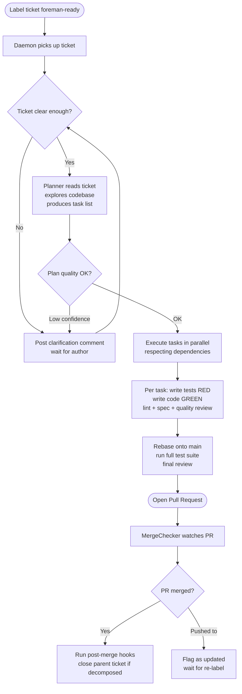

# How Foreman Works

## The Big Picture

Foreman is a 24/7 background daemon that turns labelled issue tracker tickets into tested, reviewed pull requests. You connect it to your issue tracker (Jira, GitHub Issues, or Linear), point it at your repository, and label a ticket `foreman-ready`. Foreman takes it from there: it reads the ticket, explores your codebase, writes a plan, implements each task with test-driven development, runs quality reviews, and opens a pull request — all without you touching the keyboard.

The promise is simple: label a ticket, get a PR. Everything between those two events — planning, coding, testing, linting, reviewing — is handled by Foreman. You stay in control at the one place that matters: the code review. Every PR is a human checkpoint before any code ships.

Who controls what? Foreman controls the implementation loop. You control the ticket descriptions (which become the spec), the configuration (which sets the rules), and the final merge decision.

---

## The Full Flow: From Ticket to PR

Each phase is described below with a concrete explanation of what happens and why.

---

## Phase 1: Ticket Pickup

Foreman runs as a long-lived daemon. On each poll cycle (default: every 60 seconds), it queries your issue tracker for tickets labelled `foreman-ready`. When it finds one, it claims the ticket by updating its status to `in_progress` and begins work.

Before doing anything else, Foreman checks whether the ticket has enough information to act on. It looks at the description length, whether acceptance criteria are present, and how specific the requirements are. If the ticket is too vague, Foreman posts a comment with a precise question, applies a `foreman-needs-info` label, and waits up to 72 hours for the author to respond. This prevents wasted LLM calls on ambiguous requirements.

Foreman also checks whether any of the files the ticket will need to touch are already being modified by another active pipeline. If there is a conflict, the ticket is re-queued and tried again on the next poll cycle. This file reservation system prevents two pipelines from editing the same file simultaneously.

---

## Phase 2: Planning

Once a ticket is picked up, the planner reads the ticket description and explores your codebase to understand what already exists. It produces an ordered task list, where each task includes: a title and description, specific acceptance criteria, the files to read and the files to modify, test assertions the implementation must satisfy, an estimated complexity (simple, medium, or complex), and optional dependencies on other tasks.

After the task list is generated, a deterministic validator checks it before any code is written. It verifies that all referenced file paths exist (or are explicitly marked as new), that there are no dependency cycles, that no two tasks modify the same file without an explicit ordering, and that the estimated cost fits within your configured budget.

After deterministic validation passes, a second LLM call evaluates the overall quality of the plan and returns a confidence score from 0.0 to 1.0. If the score is below the configured threshold (default: 0.6), Foreman triggers a clarification request rather than proceeding. A low-confidence plan is a sign the ticket description needs more detail, not that implementation should begin on shaky foundations.

---

## Phase 3: Implementation (Per Task)

Tasks with no unmet dependencies start executing immediately. Tasks that depend on others wait in a ready queue and start as soon as their dependencies complete. By default, up to three tasks run in parallel, using a bounded worker pool managed by a coordinator goroutine.

Each task follows a strict TDD loop:

1. The agent writes failing tests first.
2. Foreman mechanically verifies the RED phase — the tests must fail for the right reason (an assertion failure, not a compile error or missing import).
3. The agent writes the minimal implementation to make the tests pass.
4. Foreman verifies the GREEN phase — all new tests must pass.

After tests pass, Foreman runs the repo's linter. If lint fails, the error is classified and sent back to the agent with a specific retry prompt. After lint passes, a spec reviewer LLM call checks whether the implementation actually satisfies the task's acceptance criteria. After that, a quality reviewer LLM call checks for correctness issues, security problems, and maintainability gaps.

If any of these gates fail, the agent retries with targeted feedback. Before every retry, Foreman classifies the error into one of seven types (compile error, type error, lint/style, test assertion failure, test runtime error, spec violation, quality concern) and selects a retry prompt written specifically for that failure mode. A compile error gets a different prompt than a spec violation because they require fundamentally different fixes.

Every task has an absolute cap of 8 LLM calls (implementer plus reviewers combined). When a task hits the cap, it fails immediately. Independent tasks continue running unaffected.

---

## Phase 4: PR Creation

After all tasks complete, Foreman rebases the branch onto the default branch. If there are merge conflicts, it attempts to resolve them automatically using an LLM call that receives the full context of both sides plus the task descriptions. If automatic resolution fails, Foreman still opens the PR but includes a conflict warning in the description.

After a successful rebase, Foreman runs the full test suite. A full-suite failure blocks PR creation unless you have configured partial PRs (see below). If tests pass, a final reviewer LLM call inspects the complete diff across all tasks — this catches cross-task issues that per-task reviews cannot see.

The PR is opened as a draft by default, with configured reviewers automatically assigned. The PR body includes a task checklist so reviewers can see exactly what was implemented. If some tasks failed or were skipped, the checklist marks them clearly, and the PR contains only the completed work.

After the PR is created, any configured `post_pr` skill hooks fire — for example, posting a Slack notification or generating a changelog entry.

---

## Phase 5: Watching the PR

After PR creation, a dedicated `MergeChecker` goroutine polls the PR status at a configurable interval. When the PR is merged, any configured `post_merge` skill hooks fire — for example, triggering a deployment or cleaning up a branch. If the ticket was created from an oversized parent ticket that was decomposed into children, the parent ticket is automatically closed once all child PRs have merged.

If someone pushes new commits to the branch while the PR is open, Foreman detects the change (by comparing the stored HEAD SHA against the current one) and transitions the ticket to a `pr_updated` state. The ticket requires manual re-labelling with `foreman-ready` to re-enter the pipeline. This prevents Foreman from acting on a PR that has changed since its last review.

---

## The Agent: Tools and Capabilities

Foreman's built-in agent runner is a multi-turn tool-use loop. The agent calls tools, receives results, and decides what to do next — up to a configured turn limit. The tool registry is organized into groups, each serving a distinct purpose:

- **Filesystem tools** (`Read`, `ReadRange`, `Write`, `Edit`, `MultiEdit`, `ListDir`, `Glob`, `ApplyPatch`) — read and modify files. `ReadRange` reads a slice of a large file without loading the whole thing. `ApplyPatch` applies a unified diff patch as an alternative to line-by-line edits.
- **Code intelligence tools** (`Grep`, `GetSymbol`, `GetErrors`, `TreeSummary`) — search the codebase, look up symbol definitions, and get a structural overview of a directory tree without reading every file.
- **Language server tools** (`LSP`) — go-to-definition, find-references, hover, and symbol search via gopls. This gives the agent the same code navigation a developer gets in an IDE.
- **Git tools** (`GetDiff`, `GetCommitLog`) — read the current diff and recent commit history, so the agent can see what has already changed.
- **Execution tools** (`Bash`, `RunTest`) — run shell commands and tests. An allowlist of permitted commands prevents unintended side effects.
- **Web tools** (`WebFetch`) — fetch a URL as text, markdown, or raw HTML. Useful for reading API documentation or fetching a spec linked in a ticket.
- **Composition tools** (`Batch`, `Subagent`, `TodoRead`, `TodoWrite`) — `Batch` runs up to 25 tool calls in parallel within a single agent turn. `Subagent` spawns a child agent for a bounded sub-task. `TodoRead` and `TodoWrite` give the agent an in-session scratchpad task list.

All tool outputs are automatically truncated before being returned to the model. This keeps the context window from filling up with large file dumps.

For the full tool reference with descriptions and schemas, see [Agent Runner — Built-in Tools](agent-runner.md#built-in-tools).

---

## Edit Strategies: How the Agent Edits Code

When the agent wants to edit a file, it provides a search string (the code to replace) and a replacement string. The problem is that LLMs don't always reproduce whitespace, indentation, or blank lines exactly as they appear in the file. A single mismatched space will cause an exact-match replacement to fail.

To handle this, Foreman tries up to six progressively more flexible matching strategies before giving up. When a fallback strategy is used, the tool reports which one succeeded. The result is that edits almost never fail due to minor formatting differences between what the LLM remembers and what the file actually contains.

For the full strategy list, see [Agent Runner — Edit Strategy Fallback Chain](agent-runner.md#edit-strategy-fallback-chain).

---

## Context: What the Agent Knows

Every agent call receives fully assembled context — Foreman does not accumulate memory between calls. Instead, it builds the context fresh for each call from several sources:

**`AGENTS.md`** — if you place an `AGENTS.md` file at the root of your repository (or a `.foreman/context.md` for Foreman-specific content), Foreman injects it into every agent call's system prompt. This is where you put your coding conventions, test commands, naming rules, and anything else the agent should always know. You generate an initial one with `foreman context generate`, and after each merged PR, `foreman context update` incorporates new patterns the pipeline discovered.

**Hierarchical context walking** — Foreman walks upward from the agent's working directory to the repo root, collecting `AGENTS.md` and `.foreman-rules.md` files at each level. Files from deeper, more specific directories take priority over files from higher up. This means you can have project-wide rules at the root and override them with directory-specific rules in a subdirectory.

**Reactive context injection** — after each file-touching tool call (reading or editing a file), the builtin runner queries for progress patterns and scoped rules relevant to the accessed paths, and injects them as a context message before the next LLM turn. The agent gets relevant context exactly when it needs it, without the full context being repeated every turn.

**Progress patterns** — after every few completed tasks, a lightweight consistency check runs on the cumulative diff, looking for naming conventions, error handling patterns, and import style. Any violations are stored as progress patterns and fed into subsequent tasks, so the agent learns from what has already been built in the same pipeline run.

---

## Permissions and Modes

You can lock the agent into different permission modes depending on what you want it to do. Three built-in presets cover the common cases:

| Mode | What the agent can do | Use case |
|---|---|---|
| `plan` | Read files, search, take notes | Exploration and planning only; no code changes |
| `explore` | Read files, search, look up symbols | Read-only codebase investigation |
| `build` | Everything — read, write, execute | Full implementation |

For the full permission system with ruleset syntax and custom rules, see [Agent Runner — Permission System](agent-runner.md#permission-system-and-agent-modes).

---

## Observability

**Cost tracking** — every LLM call is metered and costs aggregate per ticket, per day, and per month. You can set budget limits at each level; Foreman pauses or aborts when a limit is reached. See [Agent Runner — Cost Tracker](agent-runner.md#cost-tracker) for the per-session budget enforcement details.

**Diff tracking** — after each agent session, a `DiffSummary` carries total lines added, lines deleted, and files changed. This is surfaced in logs and the dashboard so you can see the footprint of each task.

**Event bus** — all significant pipeline events are published to a typed event bus and recorded to the database. Over 40 event types cover the full lifecycle, from `ticket_picked_up` through `pr_created` to `post_merge_hook_complete`. Events are viewable via the dashboard and the `foreman logs` CLI.

**Progress events** — the agent emits `turn_start`, `tool_start`, `tool_end`, and `turn_end` events in real time. These feed the dashboard's live view and also drive mid-execution budget enforcement.

**Dashboard** — a built-in web UI (default port 8080) shows active tickets, per-ticket task breakdowns, real-time cost, and a live event log. It exposes a REST API and a WebSocket endpoint for live updates. All endpoints require a bearer token.

**Prometheus metrics** — a metrics endpoint provides counters and histograms for ticket status, LLM call counts, token usage, cost, retry counts by error type, TDD verification results, and more.

---

## Capabilities At a Glance

| Capability | Summary |
|---|---|
| **Ticket-to-PR automation** | Plan, implement, review, and open a PR end-to-end |
| **TDD-driven implementation** | Enforces RED → GREEN cycle with mechanical test verification |
| **Parallel DAG execution** | Tasks within a ticket run in parallel, respecting dependencies |
| **Tiered review gates** | Spec review, quality review, and final review at each stage |
| **Typed retry feedback** | Error classifier selects a dedicated prompt template per failure mode |
| **Plan confidence scoring** | LLM evaluates plan quality; low-confidence plans trigger clarification |
| **Context window management** | Automatic compaction keeps message history within the model's context window |
| **Self-reflection turns** | Agent pauses every N turns to assess progress; implicit stop on completion |
| **Tool call deduplication** | Warns the agent on repeated tool calls to prevent looping |
| **Accurate token counting** | tiktoken-go replaces the `len/4` heuristic for precise budget control |
| **Dynamic context budget** | Token budget scales with task complexity (low / medium / high) |
| **Pipeline context cache** | File tree, rules, and secret scan are cached per pipeline run |
| **PR update detection** | Detects mid-review pushes to open PRs and flags them for re-labelling |
| **Cross-task consistency review** | Lightweight mid-flight check catches naming and pattern inconsistencies |
| **Provider circuit breaker** | Automatically bypasses failing providers and falls back to secondary |
| **Agent progress events** | Real-time turn/tool events for dashboard visibility and cost enforcement |
| **Subagent budget inheritance** | Subagents receive turn budgets derived from the parent's remaining turns |
| **Ticket decomposition** | Oversized tickets auto-split into focused child tickets |
| **Clarification requests** | Asks for detail on vague tickets; waits for author response |
| **Partial PRs** | Creates a PR with completed work even when some tasks fail |
| **Crash recovery** | Resumes from last committed task after a daemon restart |
| **Cost control** | Per-ticket, per-day, and per-month LLM spend limits |
| **Per-session cost tracking** | `CostTracker` enforces per-session USD budgets with full breakdown |
| **File change tracking** | `DiffSummary` carries additions, deletions, and files changed per session |
| **Secrets scanner** | Redacts secret patterns from every LLM context assembly |
| **YAML skills engine** | Extend the pipeline at four hook points without modifying Go code |
| **Multi-provider LLM** | Anthropic, OpenAI, OpenRouter, local models; per-role routing |
| **Anthropic prompt caching** | `cache_control: ephemeral` on system + context blocks; cache tokens tracked |
| **Multiple issue trackers** | Jira, GitHub Issues, Linear, local file |
| **Built-in dashboard** | HTTP/WebSocket UI with REST API, Prometheus metrics, and real-time events |
| **Permission system + agent modes** | Rule-based tool permissions; built-in PlanMode, ExploreMode, BuildMode presets |
| **Tool output truncation** | All tool outputs auto-truncated (2000 lines / 50 KB / 2000 chars per line) |
| **Edit strategy fallback chain** | Six progressive strategies for SEARCH/REPLACE before failing |
| **ApplyPatch hunk validation** | Context lines validated against file before applying unified diff |
| **Async event bus** | Typed pub/sub for daemon-wide real-time event dispatch |
| **Unified prompt registry** | All prompts, agents, skills, and commands loaded from `prompts/` via pongo2 templates |
| **Hierarchical context loading** | Context files walked up from working dir to repo root; deeper files take priority |
| **Multi-directory skill discovery** | Skills scanned from `skills/` and `.foreman/skills/` at each level up to repo root |
| **Batch tool execution** | `Batch` tool runs up to 25 tool calls in parallel in a single agent turn |
| **LSP integration** | `LSP` tool exposes gopls: go-to-definition, find-references, hover, symbols |
| **Todo list management** | `TodoRead`/`TodoWrite` give agents an in-session scratchpad task list |
| **Web fetch** | `WebFetch` tool fetches URLs as text, markdown, or HTML (5 MB limit) |
| **MCP support** | MCP servers via stdio transport; tools discovered and registered automatically |
| **WhatsApp integration** | Bidirectional command and notification channel via WhatsApp Web protocol |

---

## See Also

- [Pipeline](pipeline.md) — detailed state machine and per-task execution flow
- [Configuration](configuration.md) — tune every feature with `foreman.toml`
- [Skills](skills.md) — extend the pipeline with YAML hook steps
- [Integrations](integrations.md) — issue tracker and LLM provider setup
- [Agent Runner](agent-runner.md) — builtin runner, Claude Code, and Copilot integrations
