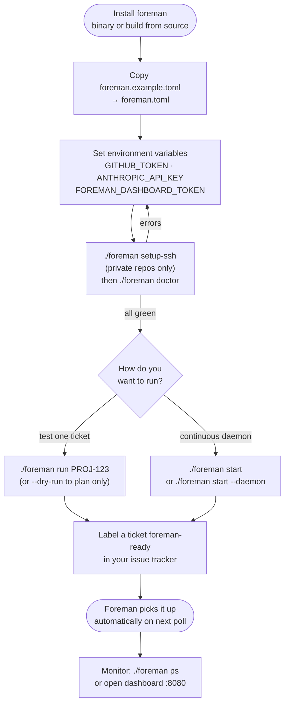

# Getting Started

This guide walks you through installing Foreman, writing a minimal configuration, and processing your first ticket.

> **Before you begin:** You need an API key for at least one LLM provider (Anthropic, OpenAI, or OpenRouter) and an issue tracker account (Jira, GitHub Issues, Linear, or a local file for testing without any external service).

## Requirements

| Requirement | Notes |
|---|---|
| Go 1.25+ | CGO is required by `go-sqlite3`; a C toolchain must be available |
| Node.js 20+ | Required when building from source (`make build` runs dashboard frontend build) |
| Git | The `git` CLI must be on `$PATH` |
| LLM API key | Anthropic, OpenAI, or OpenRouter |
| Issue tracker | Jira, GitHub Issues, Linear, or local file (no account needed) |

## Installation

### From Source

```bash
git clone https://github.com/canhta/foreman.git
cd foreman
make build
./foreman --help
```

### Download a Release Binary

Pre-built binaries for Linux (amd64/arm64) and macOS (amd64/arm64) are available on the [GitHub Releases page](https://github.com/canhta/foreman/releases).

```bash
# Example: macOS arm64
curl -L https://github.com/canhta/foreman/releases/latest/download/foreman-<version>-darwin-arm64.tar.gz | tar -xz
chmod +x foreman
./foreman --help
```

### Docker

```bash
docker pull ghcr.io/canhta/foreman:latest
```

## Configuration

Copy the example config and edit it:

```bash
cp foreman.example.toml foreman.toml
```

Minimal working config using GitHub Issues + Anthropic:

```toml
[daemon]
work_dir = "~/.foreman/work"

[tracker]
provider     = "github"
pickup_label = "foreman-ready"

[git]
provider   = "github"
clone_url  = "https://github.com/your-org/your-repo.git"

[llm]
default_provider = "anthropic"

[llm.anthropic]
api_key = "${ANTHROPIC_API_KEY}"

[dashboard]
enabled    = true
port       = 8080
auth_token = "${FOREMAN_DASHBOARD_TOKEN}"
```

Set required environment variables:

```bash
export GITHUB_TOKEN=ghp_...
export ANTHROPIC_API_KEY=sk-ant-...
export FOREMAN_DASHBOARD_TOKEN=$(./foreman token generate)
```

If your repository is private (GitHub org or personal), run the SSH setup command once:

```bash
./foreman setup-ssh
```

This generates a dedicated keypair at `~/.foreman/ssh/id_ed25519` and prints the public key. Add it to your **GitHub account** SSH keys at `https://github.com/settings/ssh/new` — this grants access to all repos your account can reach, including private org repos. Foreman automatically uses this key for all git operations via `GIT_SSH_COMMAND`.

For a complete setup guide for SSH and Jira credentials, see [Integrations](integrations.md#jira-cloud-and-server).

For a complete config reference, see [Configuration](configuration.md).

## First Run

Here is the end-to-end path from install to running ticket:



### Health Check

```bash
./foreman doctor
```

This verifies that your config is valid, all API credentials are reachable, and the database can be written.

### Run a Single Ticket (Manual)

```bash
./foreman run "PROJ-123"
# Or with a GitHub issue number:
./foreman run "42"
# Dry run (plan only, no code changes):
./foreman run "PROJ-123" --dry-run
```

### Start the Daemon

```bash
# Run in the foreground:
./foreman start

# Or as a background daemon:
./foreman start --daemon
```

The daemon polls your issue tracker at the configured interval (default: 60 seconds) and processes any ticket with the `foreman-ready` label.

### Check Status

```bash
./foreman status    # Overall daemon status
./foreman ps        # List active pipelines
./foreman ps --all  # Include completed and failed
./foreman logs      # Tail logs
./foreman logs PROJ-123  # Logs for a specific ticket
```

### View Costs

```bash
./foreman cost today
./foreman cost week
./foreman cost month
./foreman cost ticket PROJ-123
```

### Open the Dashboard

```bash
./foreman dashboard          # Print the dashboard URL
./foreman dashboard --port 8080  # Override port
```

Or navigate to `http://localhost:8080` in your browser. Use the token from `FOREMAN_DASHBOARD_TOKEN` to authenticate.

## Running with Docker Compose

```bash
# Build and start:
docker compose up --build

# Set required environment variables before starting:
export ANTHROPIC_API_KEY=sk-ant-...
export GITHUB_TOKEN=ghp_...
export FOREMAN_DASHBOARD_TOKEN=your-token
```

The default `docker-compose.yml` maps the dashboard to port `8080`. The config file `foreman.example.toml` is mounted as `/app/foreman.toml` inside the container — replace it with your own `foreman.toml`.

## WhatsApp Channel (Optional)

If you want to interact with Foreman via WhatsApp DM:

```bash
# 1. Add channel config to foreman.toml
cat >> foreman.toml << 'EOF'

[channel]
provider = "whatsapp"

[channel.whatsapp]
session_db      = "~/.foreman/whatsapp.db"
dm_policy       = "allowlist"
allowed_numbers = ["+84123456789"]   # Your phone number
EOF

# 2. Link your WhatsApp account
./foreman channel login --phone +84123456789

# 3. Verify the link
./foreman channel status
```

Once linked, start the daemon normally with `./foreman start`. You can send `/status`, `/pause`, `/resume`, `/cost` commands, or free-text ticket descriptions via WhatsApp DM.

---

## What's Next

| Goal | Document |
|---|---|
| Understand all configuration options | [Configuration](configuration.md) |
| Connect to Jira, GitHub Issues, Linear, or switch LLM providers | [Integrations](integrations.md) |
| Add security scans, changelogs, or Slack notifications | [Skills](skills.md) |
| Use Claude Code or GitHub Copilot as the agent | [Agent Runner](agent-runner.md) |
| See what Foreman can do | [Features](features.md) |
| Deploy to a server | [Deployment](deployment.md) |
| Explore the web dashboard | [Dashboard](dashboard.md) |

See [Configuration](configuration.md#messaging-channel-whatsapp) for all channel options.

---

## Adding Project Context

### Generating AGENTS.md

The quickest way to create an `AGENTS.md` for your target repository is to let Foreman generate one:

```bash
# LLM-powered (recommended — uses your configured provider)
./foreman context generate

# Static analysis only, no LLM call
./foreman context generate --offline

# Preview without writing
./foreman context generate --dry-run
```

Foreman scans your repository (config files, entry points, key sources), assembles the content within a configurable token budget, and calls your LLM provider to produce an agent-optimised `AGENTS.md` file.

To update `AGENTS.md` after merges with learned patterns:

```bash
./foreman context update
```

### Authoring AGENTS.md manually

Foreman injects project context into every agent call automatically. Create an `AGENTS.md` at the root of your target repository:

```markdown
# Project Conventions

## Code Style
- Use ESM imports (no CommonJS)
- Prefer async/await over callbacks
- All error handling must use Result types

## Architecture
- API handlers live in src/routes/
- Business logic lives in src/services/
- Do not import directly from src/db/ — use repositories

## Testing
- Jest + ts-jest
- Test files live adjacent to source: foo.test.ts next to foo.ts
- Minimum 80% coverage required
```

Foreman pre-assembles this file into the system prompt for all agent runner implementations.

## Triggering Work

Label a ticket `foreman-ready` in your issue tracker. Foreman will pick it up on the next poll cycle, plan the work, implement it task by task, and open a pull request.

For Jira, ensure the ticket has a description with acceptance criteria. For GitHub Issues, use a checklist or description. For ambiguous tickets, Foreman will comment with a clarification request before proceeding.

## Stopping the Daemon

```bash
./foreman stop
```

Active pipelines finish their current task before shutting down. Interrupted pipelines are automatically resumed on the next `foreman start`.
