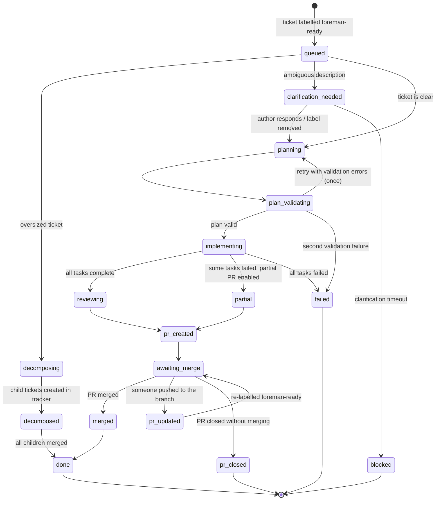
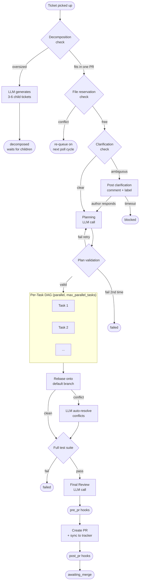
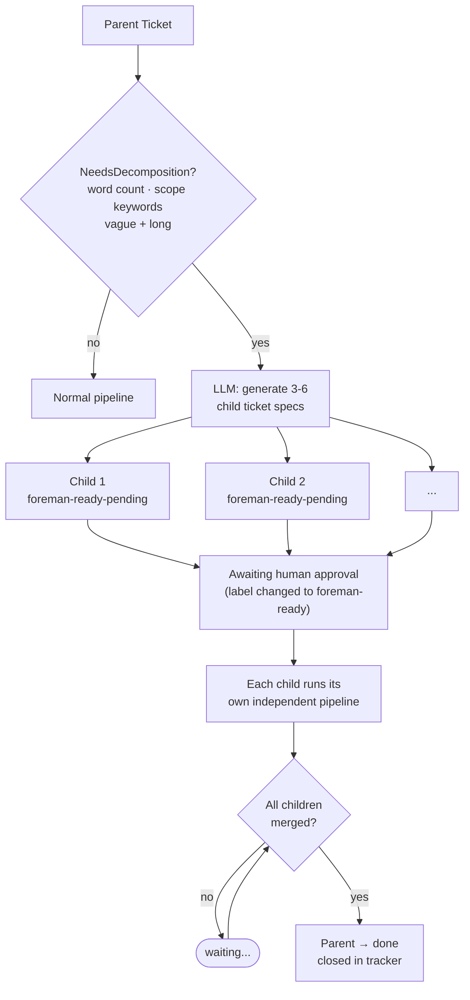
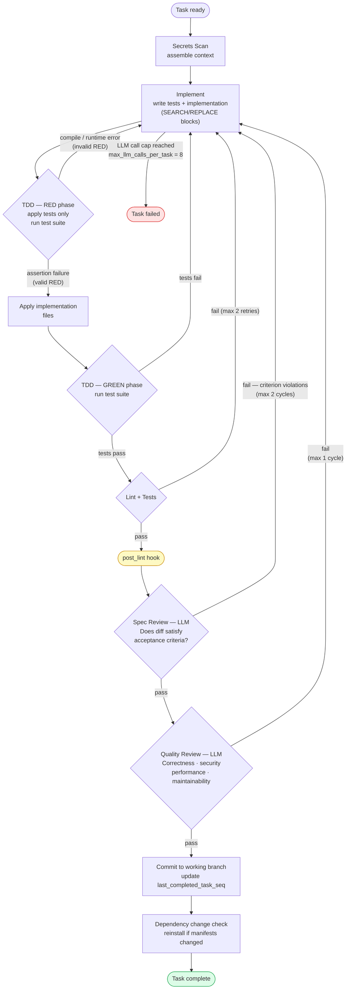

# Pipeline

This document describes the full lifecycle of a ticket as it flows through Foreman's pipeline state machine.

## State Machine Overview

The diagram below shows all ticket states and how they transition. Steps like the decomposition check, clarification check, and file reservation check are processing steps that happen between states — observable states are in bold boxes.

The **full processing pipeline** for a normal (non-decomposed) ticket follows this sequence:

---

## Pipeline Stages

### 0. Decomposition Check

Before entering the main pipeline, Foreman checks whether the ticket is too large for a single PR using deterministic heuristics:

- **Word count**: description exceeds `max_ticket_words` (default: 150)
- **Scope keywords**: multiple scope-expanding words ("and", "also", "plus", "additionally") exceed `max_scope_keywords` (default: 2)
- **Vague and long**: no acceptance criteria and description over 100 words

Child tickets (those with `decompose_depth > 0`) are never decomposed further.

If decomposition is triggered:
1. The ticket status changes to `decomposing`
2. An LLM call generates 3–6 child ticket specs with titles, descriptions, acceptance criteria, estimated complexity, and dependency relationships
3. Each child ticket is created in the tracker with a `foreman-ready-pending` label and a parent reference
4. The parent ticket is labelled `foreman-decomposed` and a summary comment is posted listing all children
5. The parent status changes to `decomposed` — it exits the pipeline and waits for all children to merge

Decomposition is disabled by default (`decompose.enabled = false`). See [Configuration](configuration.md#decomposition) for settings.

### 1. Clarification Check

Before any planning, Foreman checks whether the ticket is sufficiently detailed. Heuristic checks run without an LLM call:

- Description under 50 characters
- No acceptance criteria and no checklist in the description
- Title is a single word (e.g., "auth", "bug", "fix")

If the ticket is ambiguous, Foreman:
1. Comments on the ticket with a specific question
2. Applies the `foreman-needs-info` label
3. Records the current time in the database

On each subsequent poll cycle, Foreman skips the ticket if the clarification label is still present. When the ticket author responds and removes the label, Foreman re-enters the pipeline from the beginning.

If `clarification_timeout_hours` elapses with no response, the ticket is marked `blocked` and the clarification label is removed. The ticket can be retried by re-applying the `foreman-ready` label after updating its description.

The clarification feature can be disabled with `enable_clarification = false` in `[limits]`.

### 2. Planning

The planner receives the ticket title, description, acceptance criteria, comments, and a repo context summary. It produces a structured plan: an ordered list of tasks, each with a title, description, acceptance criteria, files to read, files to modify, test assertions, estimated complexity, and optional `depends_on` references.

When the plan is ambiguous but not completely unclear, the planner may signal `CLARIFICATION_NEEDED: <question>` in its output, which triggers the clarification flow.

### 3. Plan Validation

A deterministic validator checks the plan before any code is written:

1. **File existence**: all `files_to_read` paths exist in the repo (or are marked `(new)`)
2. **Dependency DAG**: no cycles in `depends_on` references
3. **Ordering**: no two tasks modify the same file without an explicit ordering between them (warns, does not fail)
4. **Cost estimation**: estimates total ticket cost using tiktoken-accurate token budgets and model pricing — warns at 50%, rejects at 80% of the per-ticket budget
5. **Task count**: enforces `max_tasks_per_ticket`

If validation fails, the planner is retried once with the validation errors as feedback. A second validation failure marks the ticket as failed.

### 3a. Plan Confidence Scoring

After deterministic validation passes, a second LLM call evaluates the plan's quality and returns:
- `confidence_score` (0.0–1.0)
- `concerns` list (free-text issues identified)

If `confidence_score` < `plan_confidence_threshold` (default: 0.6), Foreman triggers the clarification flow with the concerns list as the question body rather than proceeding to implementation. The score is stored in the `handoffs` table under key `plan_confidence` and is visible in the dashboard ticket view.

### 4. Per-Task Execution

Tasks execute in parallel using a coordinator/worker-pool DAG executor (`internal/daemon/dag_executor.go`). Tasks with no unmet dependencies start immediately; a task begins only when all entries in its `depends_on` list have completed successfully. The worker pool is bounded by `max_parallel_tasks` (default 3). Each task runs with an individual timeout (`task_timeout_minutes`, default 15 minutes).

If a task fails, its entire transitive closure of dependents is marked `skipped` via BFS — independent branches continue executing. For partial outcomes, Foreman creates a PR with a GitHub-flavoured checklist distinguishing completed, failed, and skipped tasks.

Each task moves through a fixed series of gates with targeted retry feedback at each stage:

#### Secrets Scan
Before assembling any LLM context, Foreman scans the files relevant to the current task using pattern matching. Files matching secret patterns (`.env`, `*.key`, `*.pem`, known API key formats, private key headers) are excluded from context. Matched files are logged as security events.

#### Context Assembly
The context assembler builds a surgical prompt context for the implementing LLM:

1. **Repo tree**: a directory listing for orientation
2. **Relevant files**: scored and ranked using import graph analysis, path proximity to `files_to_modify`, and explicit `files_to_read` lists from the task; boosted by `context_feedback` (files touched in similar past tasks that were not originally selected)
3. **Directory-specific rules**: any `.foreman-rules.md` or `AGENTS.md` files found by walking up directories from the touched paths; served from the pipeline-scoped `ContextCache`
4. **Progress patterns**: coding patterns discovered during earlier tasks of the same ticket (e.g., "uses ESM imports", "error handling pattern"), retrieved from the database
5. **Task description and acceptance criteria**
6. **Previous attempt feedback** (for retries): typed error output (see "Error Classification" below)

The token budget is assembled within `context_token_budget` scaled by `estimated_complexity` (low: 0.5×, medium: 1.0×, high: 1.5× of the base budget). The `ContextCache` pre-computes file tree, rules, and secret patterns once at pipeline start and invalidates only after git operations.

#### TDD Implementation

The implementer writes tests first, then implementation code. The output format is SEARCH/REPLACE blocks for modifications and fenced code blocks for new files.

Fuzzy matching is applied to SEARCH blocks to handle minor whitespace or formatting differences between the LLM's assumed file content and the actual file content. The similarity threshold is configurable (default: 0.92). If a SEARCH block falls below the threshold on exact match, Foreman attempts fuzzy matching and logs a `search_block_fuzzy_match` event.

#### TDD Verification

Mechanical TDD verification (enabled by default, controlled by `enable_tdd_verification`):

1. **RED phase**: Apply only test files. Run tests. They must fail.
   - `assertion` failure: valid RED — proceed
   - `compile` / `import` / `runtime` failure: invalid RED — retry implementer with specific feedback
   - Tests pass without implementation: invalid — retry with message "tests are not testing behaviour that requires implementation"

2. **GREEN phase**: Apply implementation files. Run tests. They must pass.
   - If tests fail: retry implementer with the specific failure output

#### Error Classification and Typed Retry Prompts

Before every retry, Foreman runs a deterministic error classifier over the feedback string and assigns one of seven error types: `compile_error`, `type_error`, `lint_style`, `test_assertion`, `test_runtime`, `spec_violation`, `quality_concern`. Each type selects a different retry prompt template (e.g., `implementer_retry_compile.md.j2`). The error type is stored in `tasks.last_error_type` and exposed as a Prometheus label.

#### Cross-Task Consistency Review

After every `intermediate_review_interval` completed tasks (default: 3), a lightweight LLM consistency check runs on the cumulative diff. It checks only three concerns: naming conventions, error handling patterns, and import style. Violations are injected as new `progress_patterns` entries so subsequent tasks are aware. This review does not block task execution and never triggers a retry.

#### Lint and Tests

After TDD verification:

1. Run the configured linter. Auto-fix where possible.
2. If lint fails: pass structured errors to the implementer retry (max 2 retries)
3. Run the test suite.
4. If tests fail: pass structured test output to the implementer retry (max 2 retries)

#### Spec Review

An LLM call with the task's acceptance criteria, the original ticket description, and the full task diff. The spec reviewer answers a single question: does this implementation satisfy the acceptance criteria?

- **Pass**: proceed
- **Fail**: return specific rejection reasons → retry implementer (max 2 spec review cycles)

#### Quality Review

An independent LLM call reviewing the code diff for quality concerns: correctness, security, performance, maintainability. The quality reviewer does not re-check spec compliance.

- **Pass**: proceed
- **Fail**: return specific quality feedback → retry implementer (max 1 quality review cycle)

#### Absolute LLM Call Cap

Every task tracks `total_llm_calls` as an absolute counter. This counter increments on every LLM call for that task across all roles (implementer, spec reviewer, quality reviewer). When it reaches `max_llm_calls_per_task` (default 8), the task fails immediately regardless of which review cycle triggered it.

This prevents a single difficult task from consuming unbounded budget through a combination of retries across multiple review stages.

#### Commit

After all review gates pass, the task changes are committed to the working branch with a message derived from the task title and ID. The `last_completed_task_seq` checkpoint is updated in the database.

#### Dependency Change Detection

After commit, Foreman diffs package manifest files (`go.mod`, `go.sum`, `package.json`, `package-lock.json`, `Cargo.toml`, `Cargo.lock`, `requirements.txt`, `Pipfile.lock`, etc.). If any changed, the appropriate install command is run before the next task to keep the working environment consistent.

### 5. Rebase

After all tasks complete (or partial completion), Foreman rebases the working branch onto the latest default branch. This keeps the PR diff clean and avoids stale conflicts.

If the rebase produces conflicts:
1. An LLM call receives the full file content from both base and head, plus conflict markers and task descriptions. Content is truncated in reverse priority order if it exceeds `conflict_resolution_token_budget` (default: 40 000 tokens).
2. If resolution succeeds, the rebase continues
3. If resolution fails, Foreman creates the PR anyway with a note listing the conflict files

### 6. Full Test Suite

After a clean rebase, Foreman runs the full test suite (not just per-task tests). A full-suite failure:
- Marks the ticket as failed, **or**
- Creates a partial PR if `enable_partial_pr = true` and at least some tasks succeeded

### 7. Final Review

An LLM call that reviews the complete diff across all tasks as a whole. This catches cross-task issues that per-task reviews cannot see (e.g., inconsistent naming, duplicate code, missing integration between components).

### 8. PR Creation and Hooks

Before creating the PR, `pre_pr` skill hooks run (e.g., to generate a changelog entry). After PR creation, `post_pr` hooks run (e.g., to notify a Slack channel).

File reservations are released atomically after all hooks complete.

### 9. Merge Lifecycle

After a PR is created, the ticket enters the `awaiting_merge` state. A dedicated `MergeChecker` goroutine polls PR status at a configurable interval (`merge_check_interval_secs`, default: 300 seconds).

**On PR merge:**
1. The ticket status changes to `merged`
2. `post_merge` skill hooks are executed (e.g., deployment triggers, cleanup tasks)
3. If the ticket is a child of a decomposed parent, the parent is checked for completion — when all children are merged, the parent ticket is automatically marked `done` and closed in the tracker

**On PR updated (new push detected):**
1. Foreman stores the PR HEAD SHA at creation time and compares it on each poll
2. If the SHA changes, the ticket transitions to `pr_updated` and a `pr_sha_changed` event is emitted
3. The ticket requires manual re-labelling with `foreman-ready` to re-enter the pipeline; no automated re-run occurs

**On PR closed (not merged):**
1. The ticket status changes to `pr_closed`
2. No hooks are fired — the ticket can be manually re-processed

### Ticket Statuses

| Status | Meaning |
|---|---|
| `queued` | Waiting for pickup |
| `clarification_needed` | Waiting for author response |
| `planning` | LLM generating task plan |
| `plan_validating` | Deterministic plan validation |
| `implementing` | Tasks executing |
| `reviewing` | Final review in progress |
| `pr_created` | PR submitted |
| `decomposing` | LLM generating child ticket specs |
| `decomposed` | Parent ticket — waiting for children to merge |
| `awaiting_merge` | PR open, polling for merge/close/update |
| `merged` | PR merged successfully |
| `pr_updated` | New push detected on open PR branch |
| `pr_closed` | PR closed without merging |
| `done` | Ticket complete |
| `partial` | Partial PR created |
| `failed` | Pipeline failed |
| `blocked` | Blocked (e.g., clarification timeout) |

---

## Retry Strategy Summary

| Stage | Max Retries | Feedback Provided |
|---|---|---|
| TDD verify — invalid RED | 2 | Specific failure type and test output |
| Lint failure | 2 | Structured lint errors via typed retry prompt |
| Test failure | 2 | Full test output via typed retry prompt |
| Spec review rejection | 2 cycles | Specific criterion violations (`spec_violation` prompt) |
| Quality review rejection | 1 cycle | Quality feedback (`quality_concern` prompt) |
| Plan validation failure | 1 | Validation errors |
| Plan confidence too low | 1 | Clarification triggered with concern list |
| Absolute LLM call cap | 8 per task | Task fails immediately at cap |

---

## Database Tables Used by the Pipeline

| Table | Purpose |
|---|---|
| `tickets` | Pipeline state, cost tracking, crash recovery (`last_completed_task_seq`), `pr_head_sha` |
| `tasks` | Per-task status, attempt counters, `total_llm_calls`, `last_error_type`, commit SHA |
| `llm_calls` | Full audit log of every LLM call (model, tokens, cost, duration, role, `prompt_version`, `trace_id`) |
| `llm_call_details` | Full prompt and response text linked to `llm_calls.id` |
| `handoffs` | Structured data passed between pipeline stages (incl. `plan_confidence`) |
| `progress_patterns` | Coding patterns discovered during implementation, used in future task context |
| `file_reservations` | Conflict prevention for parallel ticket processing |
| `cost_daily` | Aggregated daily cost for budget enforcement |
| `prompt_snapshots` | SHA-256 hashes of prompt templates at startup |
| `context_feedback` | Files selected vs files touched per task, used for context scoring boost |
| `events` | Full event log indexed by ticket and task |

---

## Prompt Templates

LLM system prompts are Jinja2-compatible templates (`.md.j2`) rendered with `pongo2`. Each role has a dedicated template:

| Template | Role |
|---|---|
| `prompts/planner.md.j2` | Ticket decomposition |
| `prompts/implementer.md.j2` | First-attempt implementation |
| `prompts/implementer_retry.md.j2` | Generic retry (fallback) |
| `prompts/implementer_retry_compile.md.j2` | Retry for `compile_error` |
| `prompts/implementer_retry_test.md.j2` | Retry for `test_assertion` / `test_runtime` |
| `prompts/implementer_retry_spec.md.j2` | Retry for `spec_violation` |
| `prompts/implementer_retry_quality.md.j2` | Retry for `quality_concern` |
| `prompts/spec_reviewer.md.j2` | Spec compliance review |
| `prompts/quality_reviewer.md.j2` | Code quality review |
| `prompts/final_reviewer.md.j2` | Full-diff final review |
| `prompts/clarifier.md.j2` | Clarification question generation |

At startup, Foreman computes a SHA-256 hash of every template and records it as a `prompt_snapshot`. Each LLM call records the active `prompt_version` for change tracking.

Templates have access to all relevant context variables including ticket details, task descriptions, accumulated feedback, code diffs, and repo context summaries.

---

## See Also

- [Architecture](architecture.md) — system design, concurrency model, and package layout
- [Configuration](configuration.md) — tune limits, retry caps, token budgets, and feature flags
- [Skills](skills.md) — extend pipeline hook points with custom YAML steps
- [Features](features.md) — high-level capability overview
